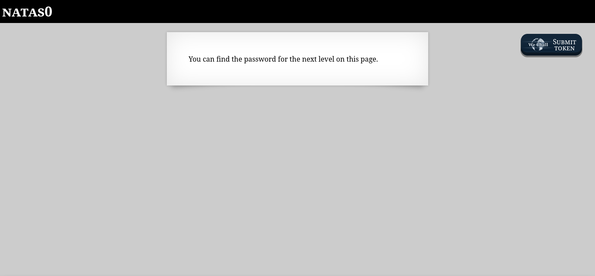
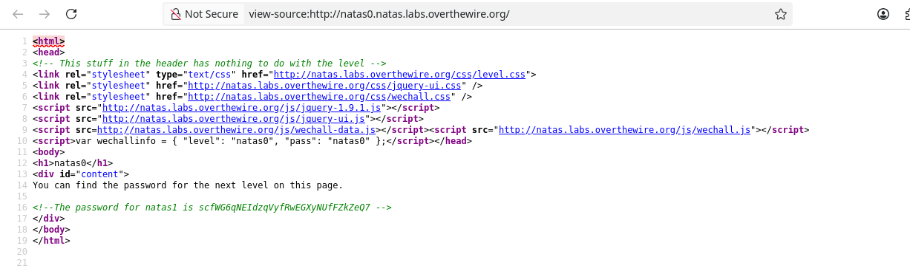

# NATAS0



O primeiro desafio, NATAS0, começa com o site

```
http://natas0.natas.labs.overthewire.org/
```

O objetivo é achar a senha escondida e seguir para o próximo site

```
http://natas1.natas.labs.overthewire.org
```

Para achar a senha, basta olhar o código-fonte da página e procurar o comentário em verde.

```
Right Click > View Page Source
```



```
scfWG6qNEIdzqVyfRwEGXyNUfFZkZeQ7
```