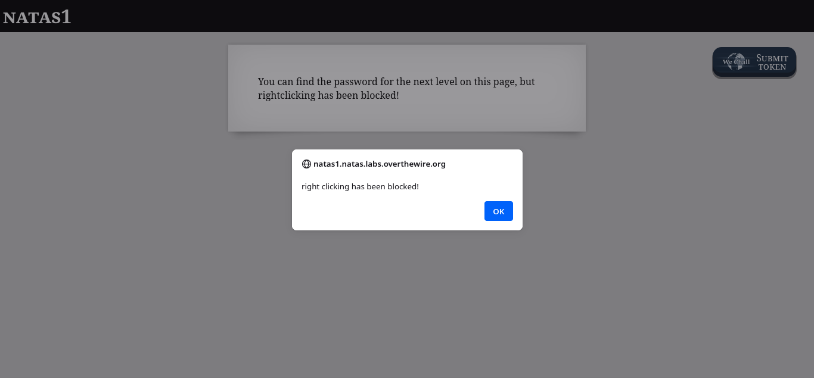
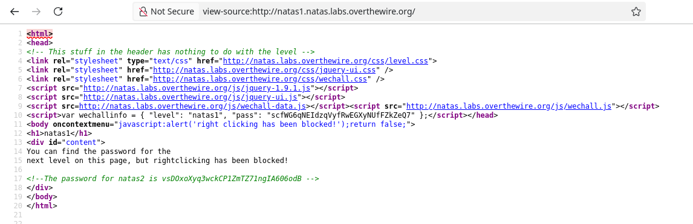

# NATAS1



Neste desafio, o botão direito está bloqueado (na verdade, o \<body> não está cobrindo toda a página, então o clique está liberado em boa parte do site). Para acessar o código-fonte, basta adicionar *view-source:* ao link.

```
view-source:http://natas1.natas.labs.overthewire.org/
```



Obtemos a senha no comentário em verde.

```
vsDOxoXyq3wckCP1ZmTZ71ngIA606odB
```