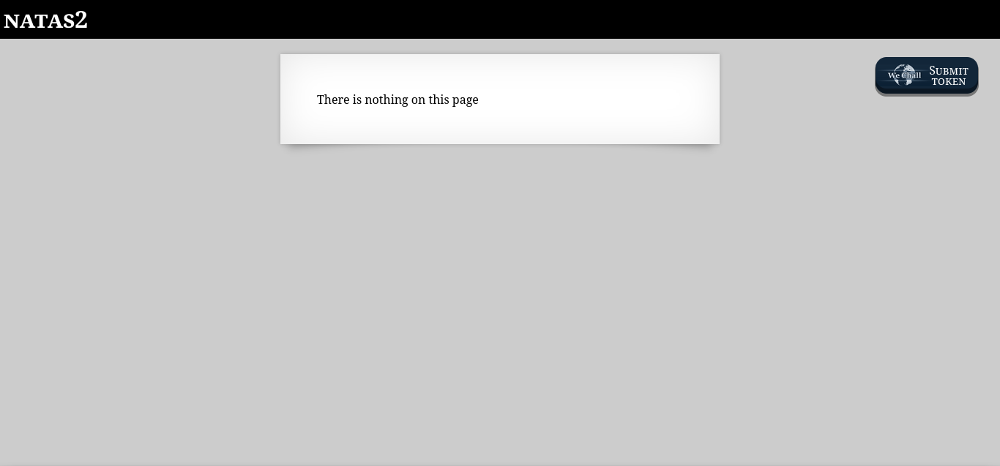
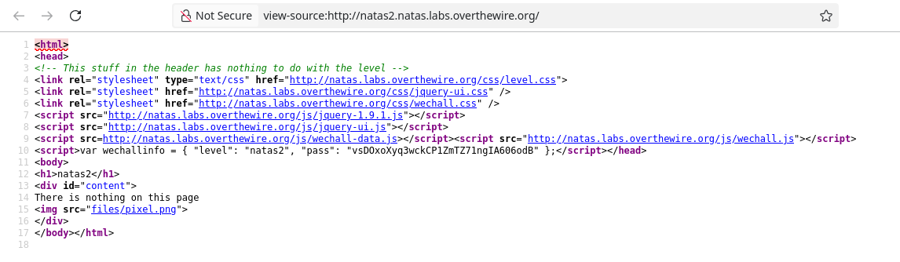
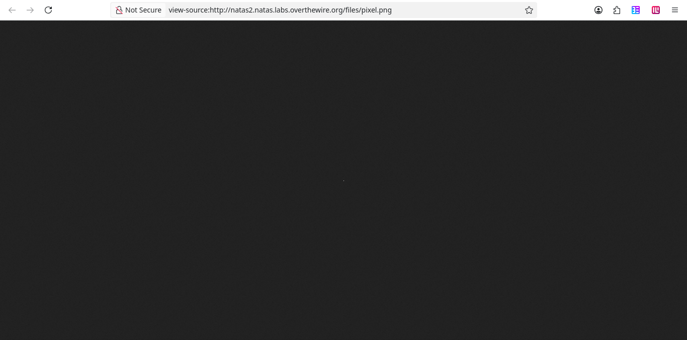
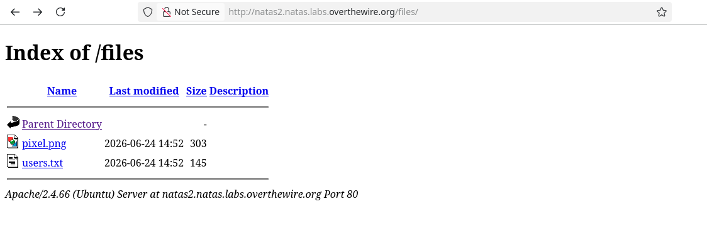
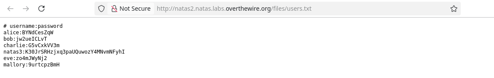

# NATAS2



A mensagem diz que não há nada no site, mas, ao inspecionar o código-fonte



Existe uma imagem em

```

```



Um único pixel branco. Porém, pode-se perceber que esse server tem um diretório *files*. Acessando o diretório pelo link

```
http://natas2.natas.labs.overthewire.org/files/
```



Há um arquivo *users.txt* além da imagem *pixel.png*.



```
K30JrSRHzjxq3paUQuwozY4MNvmNFyhI
```