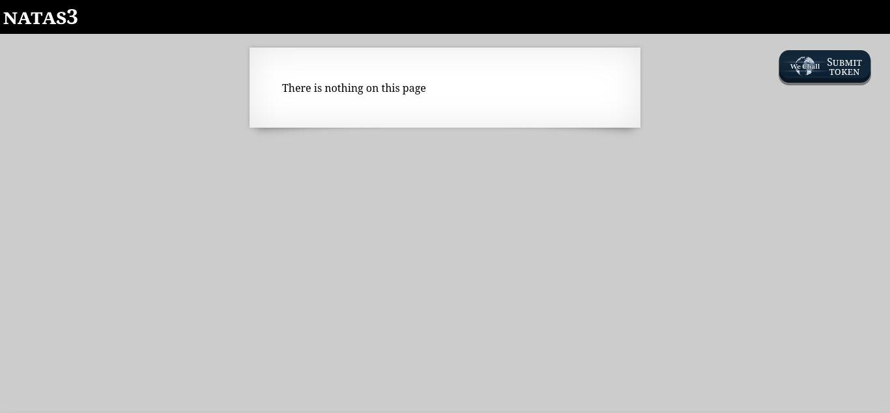
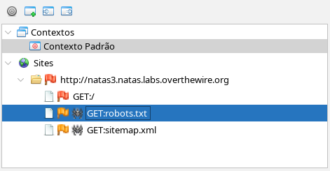
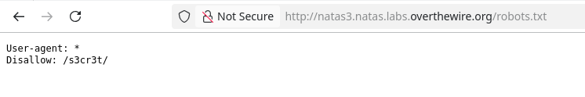
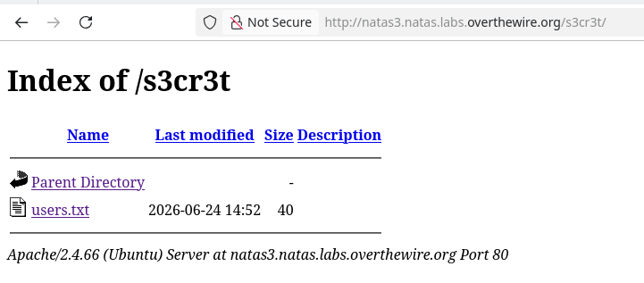
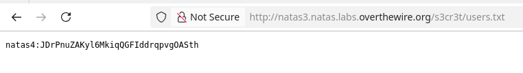

# NATAS3



A tela inicial exibe a mesma mensagem do NATAS2. Porém, o código-fonte anterior tinha uma imagem localizada no diretório *files*. Agora, o código-fonte não dá pista nenhuma sobre os diretórios do servidor. Eu comecei a pesquisar sobre como achar diretórios ocultos usando as ferramentes que o OverTheWire colocou na página inicial. Foi assim que eu descobri como usar uma *spider* com o ZAP.



Falarei mais sobre a *spider* depois, mas ela me permitiu conhecer o arquivo *robots.txt*. Esse arquivo está presente na *root* dos servidores e serve para indicar aos *search engines*, como o Google, quais diretórios eles tem permissão para entrar. Então, sabendo que *robots.txt* fica na *root*, eu poderia ter tentado acessar o arquivo diretamente, sem o uso da *spider*.

```
http://natas3.natas.labs.overthewire.org/robots.txt
```


Podemos ver que o diretório *s3cr3t* está oculto para todos os mecanismos de busca, mas isso não impede dele ser acessado. 

```
http://natas3.natas.labs.overthewire.org/s3cr3t/
```



Chegamos ao arquivo escondido.



```
JDrPnuZAKyl6MkiqQGFIddrqpvgOASth
```
