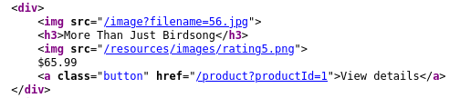
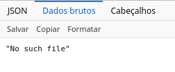
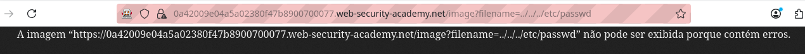
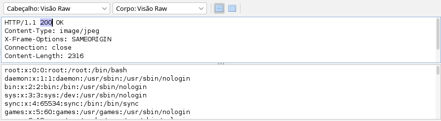

# LAB1 - File path traversal, simple case


O desafio começou com esse site de *e-commerce*. A ideia é procurar por uma vulnerabilidade específica: o *path traversal*, que nos permite ver qualquer arquivo em um *server*.



Olhando para o código HTML, podemos perceber que as imagens são chamadas por um *endpoint* */image* que recebe um parâmetro *filename=56.jpg*. Como foi explicado no *lab*, eu fiz uma requisição GET diferente para esse *endpoint*.

```
https://0a42009e04a5a02380f47b8900700077.web-security-academy.net/image?filename=/etc/passwd
```

O arquivo */etc/passwd* é um arquivo comum no Linux que guarda informações sobre todas as senhas.



Eu recebi uma mensagem de *no such file* como resposta. Nesse ponto, eu fiquei confuso e acabei resolvendo o desafio sem querer. O problema é que o *endpoint* não aceita *absolute paths*. Então, eu subi os diretórios até receber uma resposta positiva.

```
https://0a42009e04a5a02380f47b8900700077.web-security-academy.net/image?filename=../../../etc/passwd
```



Eu recebi a mensagem de *lab* concluído, porém eu não tinha realmente conseguido ler o arquivo, porque o *browser* esperava uma imagem e recebeu um *ASCII text*. Olhando a solução, eu percebi que é possível ler o arquivo se eu ver a requisição pelo ZAP.



Em cima, podemos ver uma resposta 200, que indica uma solicitação bem-sucedida, e abaixo, as informações do arquivo *passwd*.
