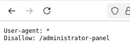
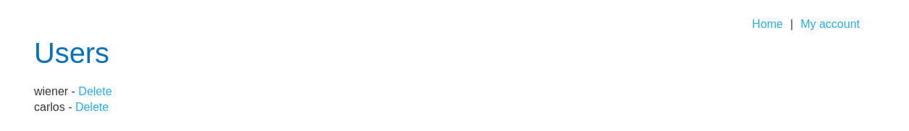

# LAB2 - Unprotected admin functionality

O *lab* nos informa que há um painel administrativo desprotegido. Graças ao NATAS3 do Over the Wire, eu já tinha aprendido sobre o *robots.txt*.

```
https://0aac008c04c9f65881b4de2400c80042.web-security-academy.net/robots.txt
```



Podemos ver que a página */administrator-panel* está oculta para as *search engines*, mas nada nos impede de acessá-la diretamente.

```
https://0aac008c04c9f65881b4de2400c80042.web-security-academy.net/administrator-panel
```



Conseguimos acesso ao controle de usuários do *site*. Basta deletar o usuário *carlos* para concluir o desafio.