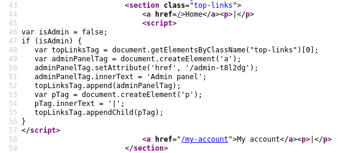
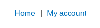
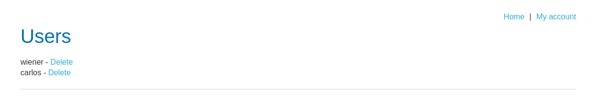

# LAB3 - Unprotected admin functionality with unpredictable URL

O desafio é o mesmo do *lab* anterior: achar a página do administrador. Porém, agora a URL é menos óbvia do que */administrator-panel*, prevenindo um *brute force* se fosse um site real. Também não é possível achar o *robots.txt*.



Olhando para o código, fica evidente o destaque para esse trecho. Se um administrador acessar o site, será criado um novo *link* no painel *top-links*. Perceba que o atributo *href* do novo botão está *hardcoded*. 

```js
adminPanelTag.setAttribute('href', '/admin-t8l2dg');
```

Caso contrário, se for um usuário comum, o painel terá apenas os botões *Home* e *My account*.



Porém, mesmo não tendo o botão na tela, é possível acessar o *link* que leva para a página do administrador.

```
https://0ab5002e03dae0f180be767900d800c1.web-security-academy.net/admin-t8l2dg
```



Agora basta deletar o usuário *carlos* novamente.