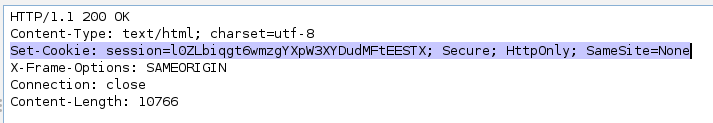
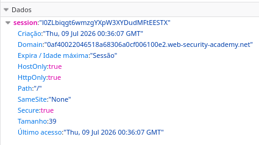
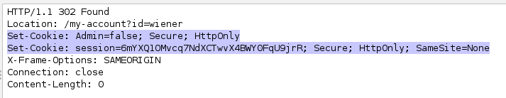
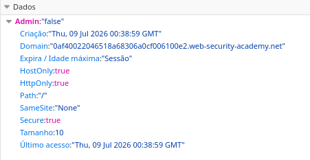
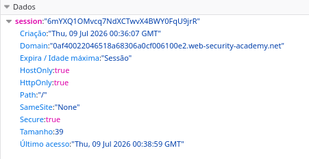
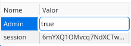
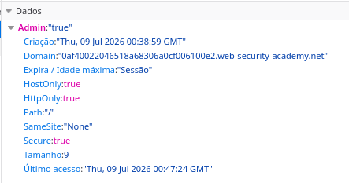
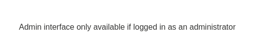
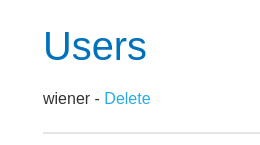

# LAB4 - User role controlled by request parameter

Neste desafio, eu precisei ler um pouco sobre *cookies*. Até então, eu só conhecia o termo por conta das mensagens de *accept all cookies*, mas nunca busquei saber o que eram. Um *cookie* é um pedaço de dados que fica salvo no *browser*.



Isso não é importante para o desafio, mas aqui nós vemos que, na primeira requisição GET enviada para o servidor, ele nos responde com um *cookie* de sessão. No *browser* também é possível vê-lo.



Acessando a página de *login* do site e colocando os dados de acesso providenciados pelo *lab*, dois novos *cookies* são enviados pelo servidor após a requisicão POST do formulário.



O primeiro dita o tipo de usuário que fez *login*: *admin* ou não *admin*. E o segundo é um novo *cookie* de sessão.




O problema é que os *cookies* ficam armazenados no *browser*, ou seja, na máquina do USUÁRIO. Portanto, eu posso modificá-los.




Antes da mudança, eu fui barrado ao acessar o painel de administração.

```
https://0af40022046518a68306a0cf006100e2.web-security-academy.net/admin
```



Após a mudança:

