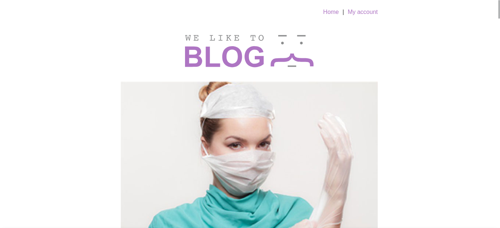
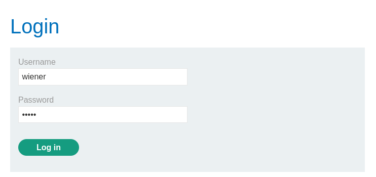
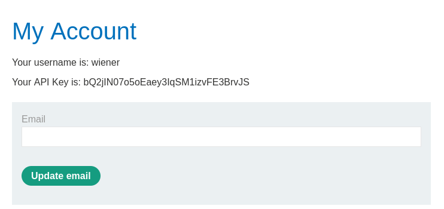
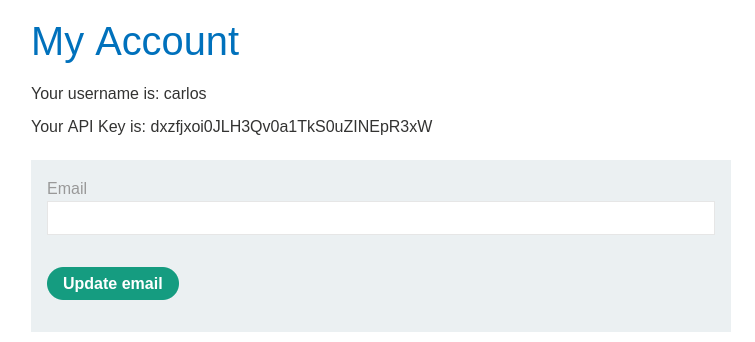

# LAB5 - User ID controlled by request parameter, with unpredictable user IDs



Neste *lab* foram introduzidos dois conceitos novos: *privilege escalation* e *GUIDs (Globally Unique Identifiers)*. *Privilege escalation* é uma falha de segurança onde um usuário acessa informações privadas de outros usuários. No *lab* anterior, nós vimos uma falha de *vertical privilege escalation*, pois conseguimos acessar um paínel administrativo, ou seja, informações privadas de um usuário com mais privilégios. Agora, nós veremos um *horizontal privilege escalation*, porque devemos acessar a conta de um usuário com os mesmos privilégios que os nossos. Começaremos pelo login:





Podemos ver nossa *API Key*, porém estamos buscando a do usuário *carlos*. Na URL dessa página, podemos ver nosso GUID.

```
https://0adf00d00400f99680e2df4900d2006e.web-security-academy.net/my-account?id=074fcaf7-4937-470f-91f0-a51ef165a946
```

Basta acharmos o GUID de *carlos* e trocá-lo pelo nosso na URL. Explorando a *home page*, podemos encontrar alguns *posts* feitos por *carlos*.


Bingo! Os *posts* contêm *links* que levam a mais informações sobre os autores. Observando a URL dessa página, temos:

```
https://0adf00d00400f99680e2df4900d2006e.web-security-academy.net/blogs?userId=936f6f62-a92a-41d5-8272-33a8bdcecb82
```

Obtemos o GUID de *carlos*. Trocando-o na URL da página *my account*:



Achamos a *API Key* de *carlos*.